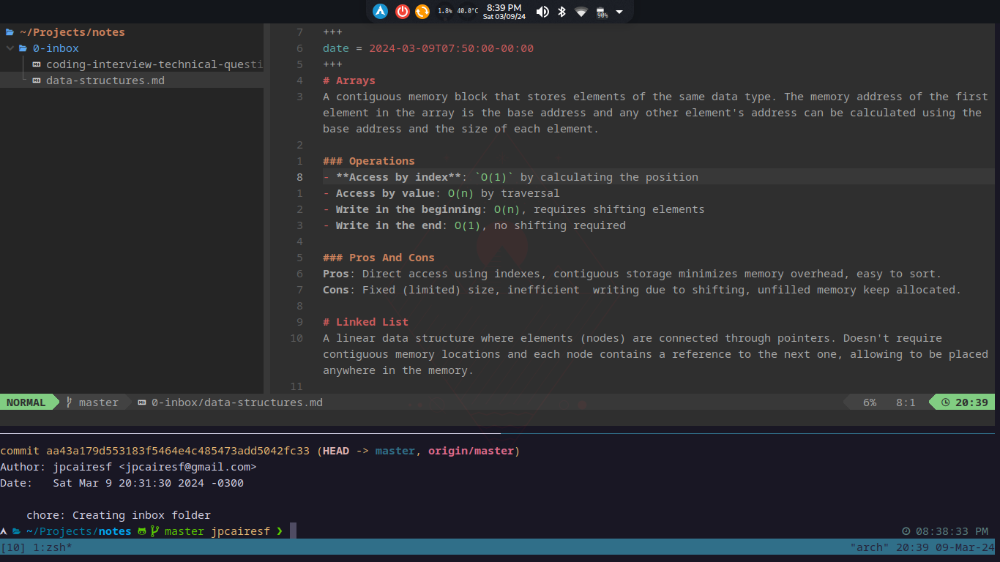

# dotfiles

Sources that inspired me:

- [Arch Linux: A Comfy Install Guide](https://www.youtube.com/watch?v=68z11VAYMS8)
- [ayamir/nvimdots](https://github.com/ayamir/nvimdots)
- [O Melhor Setup Dev com Arch e WSL2 - Fábio Akita](https://www.youtube.com/watch?v=sjrW74Hx5Po) \*PT-BR
- [Tmux has forever changed the way I write code. - Dreams of Code](https://www.youtube.com/watch?v=DzNmUNvnB04)
- [35+ Eclipse Shortcuts and Productivity Tips for Java Developers!](https://www.turing.com/blog/eclipse-shortcuts-and-productivity-tips/)

## Neovim

You can find my [keybindings here](https://github.com/jpcairesf/dotfiles/blob/master/nvim/keybindings.md) (also inspired in ayamir/nvimdots wiki keybindings).

## Workspace

